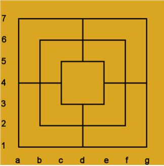

# Studienarbeit - Entwicklung einer KI für das Brett-Spiel "Mühle"

## Aufgabenstellung
Das Spiel Mühle ist ein bekanntes Brettspiel, das sich aufgrund der vergleichsweise einfachen Regeln ohne allzu großen Aufwand implementieren lässt. Ziel der Arbeit ist die Entwicklung eines 
Jupyter-Notebooks, in dem das Mühle-Spiel implementiert wird. Das Spiel soll mit Hilfe der Sprache Python 
implementiert werden. Die grafische Oberfläche soll mit Hilfe von [ipywidgets](https://ipywidgets.readthedocs.io/en/latest/) 
und [ipycanvas](https://ipycanvas.readthedocs.io/en/latest/) gestaltet werden. 

Die eigentliche Spiellogik soll mit Hilfe von alpha-beta-Pruning implementiert werden. 
Zusätzlich sollten Transpositions-Tabellen verwendet werden. 
Diese Verfahren sind in dem Skript zur KI dokumentiert. 

Ziel der Arbeit ist die Erstellung eines gut dokumentierten Programms, an Hand dessen die verschiedenen Techniken bei der Erstellung einer Spiele-KI im Rahmen der KI-Vorlesung vorgestellt werden können. 

## Spielablauf
Das Spiel läuft in drei Phasen ab:

- Setzphase: Die Spieler setzen abwechselnd je einen Stein, insgesamt je neun, auf Kreuzungs- oder Eckpunkte des Brettes
- Zugphase: Die Spielsteine werden gezogen, das heißt, pro Runde darf jeder Spieler einen Stein auf einen angrenzenden, freien Punkt bewegen. Kann ein Spieler keinen Stein bewegen, so hat er verloren.
- Endphase: Sobald ein Spieler nur noch drei Steine hat, darf er mit seinen Steinen springen, das heißt, er darf nun pro Runde mit einem Stein an einen beliebigen freien Punkt springen. Sobald ihm ein weiterer Stein abgenommen wird, hat er das Spiel verloren.

Drei Steine einer Farbe, die in einer Geraden auf Feldern nebeneinander liegen, nennt man eine „Mühle“. Wenn ein Spieler eine Mühle schließt, darf er einen beliebigen Stein des Gegners aus dem Spiel nehmen, sofern dieser Stein nicht ebenfalls Bestandteil einer Mühle ist. Die offiziellen Turnierregeln erlauben seit 2010 das Schlagen eines Steines aus einer geschlossenen Mühle, wenn der Gegner nur noch Steine in geschlossenen Mühlen hat. Regional und teilweise auch in kommerziell vermarkteten Produkten wird dies jedoch anders gehandhabt.

## WMD-Notation

*Quelle: Dr. Rainer Rosenberger, http://muehlespieler.de/download/muehle_lehrbuch.pdf*

Die Spalten werden von links beginnend
von a bis g benannt. Die Zeilen werden von unten beginnend
von 1 bis 7 durchnummeriert. Gültige Feldnamen sind beispielsweise a1, d2, e3 oder g7.

Bei dieser Notation gehört nicht zu jeder Buchstaben- und Zahlenkombination aus a..g und 1..7 auch ein Feld. Ungültige
Feldbezeichnungen sind beispielsweise b3, d4, f5 oder g6.
Diese Notation ähnelt der beim Schach, wo die 64 Felder von a..h und 1..8 benannt werden. Allerdings gehört beim Schach zu
jeder Zahlen/Buchstabenkombination auch ein Feld.

Beim Setzen schreibt man das Zielfeld auf, zum Beispiel **a1** oder **e4**. Beim Ziehen werden die Namen des durch Minus getrennten Quell- und Zielfeldes verwendet, zum Beispiel **f2-f4** oder **d3-d2**. Wird ein Mühle gebildet und ein Stein geschlagen, dann wird der geschlagene Stein durch x getrennt und an den Zug angefügt, beispielweise **f2-f4xd5** (Zug von f2 nach f4, Mühle und geschlagen wird d5).
